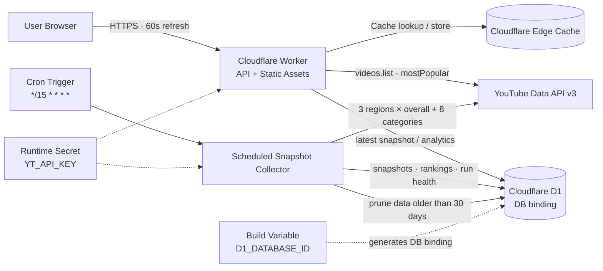

# PulseTube Radar


[](#english)
[](#한국어)

A serverless radar for discovering what is accelerating on YouTube across Korea, Japan, and the United States — live rankings, category signals, rank movement, and view momentum.

대한민국·일본·미국 YouTube 인기 영상의 현재 순위부터 카테고리 흐름, 순위 변동, 조회 모멘텀까지 탐색하는 서버리스 트렌드 레이더입니다.

---

<a id="english"></a>

## English

### Overview

PulseTube Radar reads the YouTube Data API v3 from a Cloudflare Worker and presents the latest trending videos for Korea, Japan, and the United States in a responsive dashboard. When Cloudflare D1 is connected, a scheduled collector stores snapshots every 15 minutes and turns the live feed into historical trend intelligence.

The project is independently implemented and does not require AWS infrastructure or AI services.

### Highlights

- Live KR, JP, and US `mostPopular` feeds with a persistent country switcher and server-side API-key protection
- Overall ranking and 8 fixed categories: Music, Gaming, Entertainment, News & Politics, Sports, Film & Animation, Science & Technology, and Comedy
- Rank changes, new entries, exits, and real view growth per hour
- Duration collection, duration-based Shorts candidates, format-specific percentiles, and a dedicated Early Signals view
- Momentum, acceleration, and breakout signals after enough same-format observations
- 24-hour, 7-day, and 30-day video history with category-share and churn views
- Collector health, successful scope count, collected video count, and estimated API quota usage
- 60-second client refresh, edge caching, responsive navigation, and 10 color themes
- No sample-data fallback in production: upstream failures remain visible and retryable

### Architecture



| Component | Responsibility |
| --- | --- |
| Worker + Static Assets | Serves the responsive UI and handles `/api/youtube/*` requests |
| Edge Cache | Reduces repeated YouTube API calls and improves response latency |
| YouTube Data API v3 | Supplies the current `mostPopular` feed for the selected KR, JP, or US market |
| D1 | Stores snapshots, rankings, momentum metrics, and collector runs |
| Cron Trigger | Runs 27 scopes (3 regions × overall and 8 categories) every 15 minutes |
| Runtime Secret | Keeps `YT_API_KEY` on the server and out of browser bundles |
| Build Variable | Generates the production `DB` binding without exposing credentials |

The live feed works with only `YT_API_KEY`. D1 is required for scheduled collection, historical charts, rank deltas, and breakout analysis.

- First snapshot: establishes the baseline
- Second snapshot (~15 minutes): enables movement and growth metrics
- Third snapshot (~30 minutes): enables acceleration and breakout signals

### Local development

Requirements: Node.js 22 or later and npm.

```bash
git clone https://github.com/BokEumEom/pulsetube-radar.git
cd pulsetube-radar
npm ci
npm run dev
```

For live local data, create an untracked `.dev.vars` file:

```dotenv
YT_API_KEY=your_youtube_data_api_key
```

Never commit API keys or paste their real values into documentation.

### Cloudflare deployment

1. Connect this repository to Cloudflare Workers Builds.
2. Store `YT_API_KEY` under **Runtime variables and secrets** as a secret.
3. To enable history, create a D1 database named `pulsetube-radar-history`.
4. Apply the D1 migrations in order:

```bash
npx wrangler d1 execute pulsetube-radar-history --remote --file=drizzle/0000_sweet_invaders.sql
npx wrangler d1 execute pulsetube-radar-history --remote --file=drizzle/0001_rich_overlord.sql
npx wrangler d1 execute pulsetube-radar-history --remote --file=drizzle/0002_hesitant_songbird.sql
```

5. Add these under **Workers Builds → Build variables and secrets**:

| Variable | Purpose | Required |
| --- | --- | --- |
| `D1_DATABASE_ID` | D1 database UUID used to generate the `DB` binding | For history |
| `D1_DATABASE_NAME` | D1 database name | Optional |
| `YT_API_KEY` | YouTube Data API v3 key | Runtime secret, not a build variable |

6. Select **Retry build**. A successful production build runs the deploy command with the current build configuration.

The deployed Worker should expose a `DB` binding and the `*/15 * * * *` Cron Trigger when D1 is enabled. See [DEPLOYMENT.md](./DEPLOYMENT.md) for the full deployment and migration guide.

### Useful endpoints

| Endpoint | Description |
| --- | --- |
| `GET /api/youtube/trending?region=KR` | Latest overall or category feed (`KR`, `JP`, or `US`) |
| `GET /api/youtube/history?region=KR&videoId=...&hours=168` | Per-video time series for one region |
| `GET /api/youtube/category-trends?region=KR&hours=168` | Category-share history for one region |
| `GET /api/youtube/churn?region=KR&hours=168` | Entries and exits for one region |
| `GET /api/youtube/storage-status` | D1 storage state |
| `GET /api/youtube/collector-status` | Scheduled collector health |

### Validation

```bash
npm run lint
npm run build
npm test
```

---

<a id="한국어"></a>

## 한국어

### 소개

PulseTube Radar는 Cloudflare Worker에서 YouTube Data API v3를 호출해 대한민국·일본·미국 인기 영상을 전환 가능한 반응형 대시보드로 제공합니다. Cloudflare D1을 연결하면 15분마다 스냅샷을 저장하여 현재 인기 목록을 순위 변화와 조회 모멘텀을 분석할 수 있는 시계열 데이터로 확장합니다.

AWS 인프라나 AI 서비스 없이 독립적으로 구현한 프로젝트입니다.

### 주요 기능

- API 키가 브라우저에 노출되지 않는 대한민국·일본·미국 실시간 인기 영상 피드와 선택 국가 기억
- 전체 순위와 음악·게임·엔터테인먼트·뉴스/정치·스포츠·영화/애니메이션·과학기술·코미디 8개 분야
- 직전 순위 대비 상승·하락, 신규 진입·이탈, 실제 시간당 조회 증가량
- 영상 길이 수집, 180초 이하 Shorts 후보 분류, 포맷별 백분위와 전용 Early Signals 화면
- 같은 포맷의 충분한 스냅샷이 쌓인 뒤 가속도·모멘텀·급상승 신호 제공
- 영상별 24시간·7일·30일 시계열과 카테고리 점유율·진입/이탈 분석
- 예약 수집 상태, 성공 범위, 수집 영상 수, 예상 API 사용량 확인
- 60초 자동 갱신, 엣지 캐시, 반응형 탐색 메뉴, 10종 컬러 테마
- 운영 환경에서 샘플 데이터를 섞지 않고 실제 연동 오류와 재시도 상태 표시

### 아키텍처 구성

위 아키텍처는 화면과 API를 하나의 Cloudflare Worker에서 제공하고, 현재 조회는 Edge Cache와 YouTube Data API를 사용합니다. 15분 Cron 수집기는 3개국의 전체 및 8개 카테고리를 조회해 D1에 국가별 스냅샷·순위·수집 상태를 저장합니다.

| 구성 요소 | 역할 |
| --- | --- |
| Worker + Static Assets | 반응형 UI 제공 및 `/api/youtube/*` 요청 처리 |
| Edge Cache | 반복적인 YouTube API 호출 감소 및 응답 속도 개선 |
| YouTube Data API v3 | 선택한 대한민국·일본·미국 시장의 현재 인기 영상 원본 데이터 제공 |
| D1 | 스냅샷·순위·모멘텀·수집 실행 상태 저장 |
| Cron Trigger | 15분마다 3개국의 전체 및 8개 카테고리, 총 27개 범위 수집 실행 |
| Runtime Secret | `YT_API_KEY`를 브라우저 번들 밖에서 안전하게 관리 |
| Build Variable | 운영 배포에 `DB` binding 생성 |

`YT_API_KEY`만 설정해도 현재 인기 피드는 동작합니다. 예약 수집, 과거 차트, 순위 변화 및 급상승 분석에는 D1 연결이 필요합니다.

- 첫 번째 스냅샷: 비교 기준 생성
- 두 번째 스냅샷(약 15분): 순위 변화와 조회 증가량 활성화
- 세 번째 스냅샷(약 30분): 가속도와 급상승 신호 활성화

### 로컬 실행

Node.js 22 이상이 필요합니다.

```bash
git clone https://github.com/BokEumEom/pulsetube-radar.git
cd pulsetube-radar
npm ci
npm run dev
```

로컬 실데이터 확인 시 Git에 포함되지 않는 `.dev.vars`를 생성합니다.

```dotenv
YT_API_KEY=your_youtube_data_api_key
```

실제 API 키는 커밋하거나 문서에 기록하지 마세요.

### Cloudflare 배포

- `YT_API_KEY`: **Runtime variables and secrets**의 Secret
- `D1_DATABASE_ID`: **Workers Builds → Build variables and secrets**
- `D1_DATABASE_NAME`: 같은 위치의 선택 Build variable
- D1 binding 이름: `DB`
- Cron Trigger: `*/15 * * * *`

D1 데이터베이스를 만든 뒤 `drizzle/0000_sweet_invaders.sql`, `drizzle/0001_rich_overlord.sql`, `drizzle/0002_hesitant_songbird.sql`을 순서대로 적용하고 **Retry build**를 실행합니다. 기존 DB에는 `0002`만 추가 적용하면 됩니다. 상세 절차와 Vercel 대안은 [DEPLOYMENT.md](./DEPLOYMENT.md)를 참고하세요.

### 검증

```bash
npm run lint
npm run build
npm test
```

## Reference

The product flow was informed by [whchoi98/youtube-trend](https://github.com/whchoi98/youtube-trend). PulseTube Radar uses its own name, source code, Cloudflare architecture, and feature implementation.

제품 흐름을 검토할 때 위 프로젝트를 참고했으며, 브랜드·소스 코드·Cloudflare 아키텍처·기능 구현은 별도로 구성했습니다.
